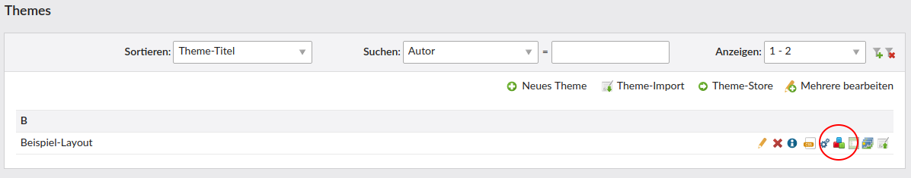
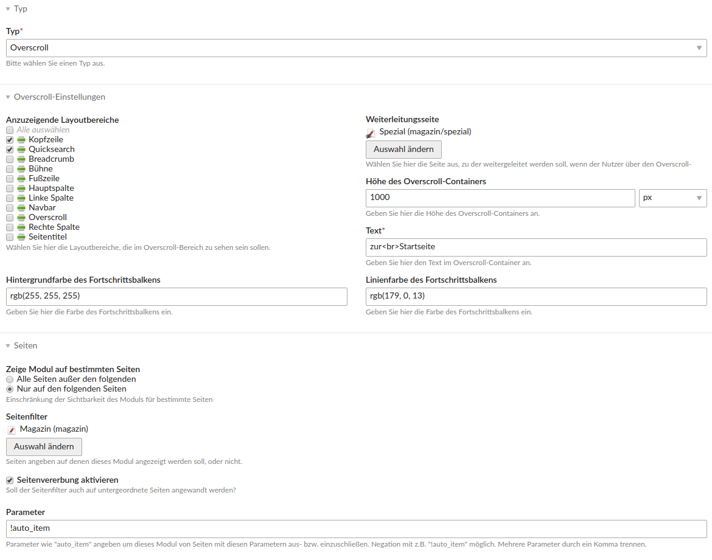
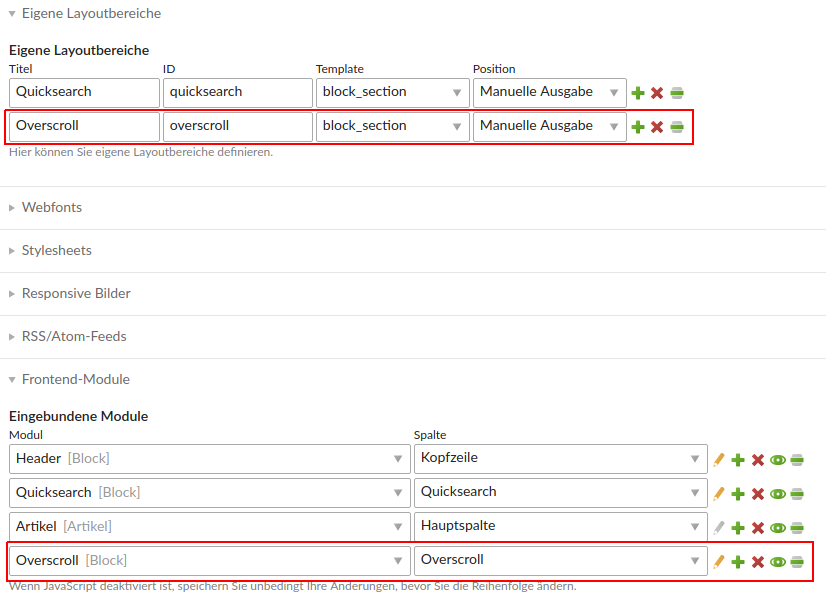

# Contao Overscroll Bundle

This bundle offers overscroll functionality (as often used on news websites) for Contao pages.


## Features

- add a mimic content area after the regular content of your pages
- add an animated circle progress bar that changes on scroll event
- after overscrolling this mimic area, some url is opened

### Technical instructions

1\. This bundle depends on [heimrichhannot/contao-blocks](https://github.com/heimrichhannot/contao-blocks) for specifying on which pages (and under which circumstances) the overscroll area is shown.
   Hence the first step is to create a block and configure the overscroll area to your needs:

   

   

2\. After that you have to define the necessary custom section *(ATTENTION: The ID of the section has to be "overscroll")* and link the block created above in this section.

   

3\. If you want to add custom sections (sections other than header, left, right, main and footer) to the overscrolling area, you'll have to create contao frontend templates named `section_<name>.html5`for each of these areas.
    Example:

    ```
    <?php if ($this->quicksearch): ?>
        <!-- indexer::stop -->
        <div id="quicksearch">
            <div class="inside">
                <?= $this->quicksearch ?>
            </div>
        </div>
        <!-- indexer::continue -->
    <?php endif; ?>
    ```
4\. Finally put the overscroll section into your `fe_page.html5`:

    ```
    <?php if ($this->sections['overscroll']): ?>
        <?= $this->sections['overscroll'] ?>
    <?php endif; ?>
    ```

Optional:

5\. The JavaScript and CSS assets of this bundle are organized using [heimrichhannot/contao-components](https://github.com/heimrichhannot/contao-components). Hence you can easily switch them on or off in your layout under "Disable components".

### Hooks

Name | Arguments | Expected return value | Description
---- | --------- | --------------------- | -----------
adjustOverscroll | $frontendTemplate, $blockModule, $page, $layout | - | Adjust the overscroll element by manipulating `$frontendTemplate` (see `HeimrichHannot\OverscrollBundle\EventListener\HookListener::renderOverscrollBlock()` on what is configurable)